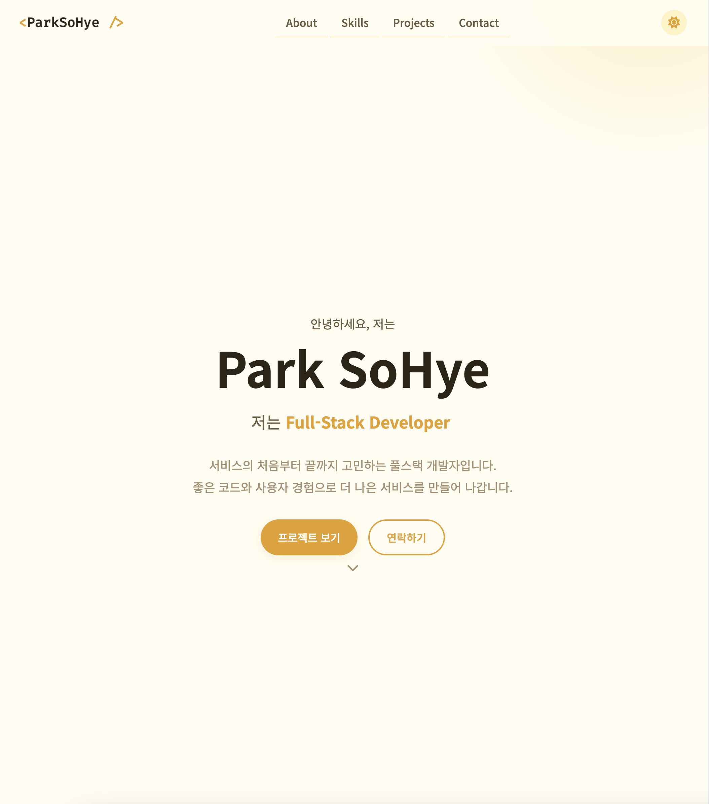
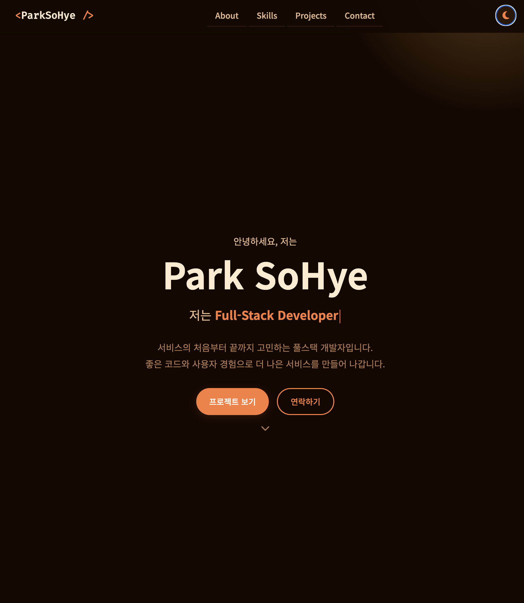
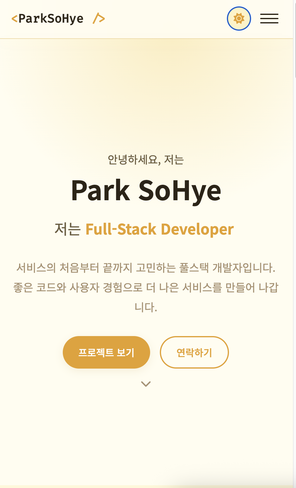

# 포트폴리오 웹사이트

순수 HTML / CSS / JavaScript(Vanilla)로 제작한 반응형 개인 포트폴리오 사이트입니다.  
외부 UI 라이브러리(jQuery, Bootstrap, Tailwind 등) 없이 웹의 기본 동작 원리를 직접 구현하는 데 초점을 맞췄습니다.

---

## 🔗 배포 URL

**GitHub Pages:** `https://sohye-pk.github.io/b1-1/`

---

## 🖼️ 스크린샷

| 데스크톱 라이트 | 데스크톱 다크 | 모바일 |
|:---:|:---:|:---:|
|  |  |  |

---

## 사용 기술

| 분류 | 내용 |
|---|---|
| 마크업 | HTML5 (시맨틱 태그) |
| 스타일 | CSS3 (Flexbox, Grid, CSS 변수, 미디어 쿼리) |
| 스크립트 | JavaScript ES6+ (Vanilla, async/await, Intersection Observer) |
| 폰트 | Google Fonts — Noto Sans KR, Fira Code |
| 아이콘 | Font Awesome 6 |
| API | GitHub REST API |
| 배포 | GitHub Pages |

---

## 폴더 구조

```
portfolio/
├── index.html          # 메인 페이지
├── css/
│   └── style.css       # 전체 스타일시트 (모바일 퍼스트)
├── js/
│   └── main.js         # 전체 스크립트 (Vanilla JS)
├── images/
│   ├── profile.jpg     # 프로필 이미지
│   └── resume.pdf      # 이력서
└── README.md
```

---

## 구현 기능

### 필수 기능

#### HTML — 시맨틱 마크업
- `<header>`, `<nav>`, `<main>`, `<section>`, `<article>`, `<footer>` 시맨틱 태그 사용
- **Hero** · **About** · **Skills** · **Projects** · **Contact** · **Footer** 섹션 구성
- 모든 이미지 `alt` 속성 작성, 폼 `<label>` — `for`/`id` 매칭 완료

#### CSS — 레이아웃 & 반응형
- **모바일 퍼스트** 작성 (기본 → 768px → 1024px 순서)
- `:root` CSS 변수로 색상·폰트·간격 일괄 관리
- `[data-theme="dark"]`로 다크 모드 전용 변수 분리
- **Flexbox**: 네비게이션(로고 왼쪽 / 메뉴 오른쪽), About 그리드, Contact 그리드
- **Grid**: Projects 카드 (`auto-fit`, `minmax(280px, 1fr)`)
- 버튼·카드 `hover` 효과 + `transition`, 카드 `box-shadow` 적용

#### JavaScript — DOM & 이벤트
- `defer` 속성으로 로드, `const` / `let`만 사용, `addEventListener`로 이벤트 연결
- `querySelector` · `querySelectorAll` · `classList` · `textContent` · `innerHTML` 사용

#### 인터랙션
- **햄버거 메뉴**: `classList.toggle('active')` — 모바일에서 메뉴 열기/닫기
- **부드러운 스크롤**: `scrollIntoView({ behavior: 'smooth' })`
- **스크롤탑 버튼**: 스크롤 **300px** 이상 시 버튼 표시, 클릭 시 최상단으로 이동
- **헤더 스타일 변경**: 스크롤 **60px** 이상 시 `.scrolled` 클래스 추가 (배경색 변경)
- **다크 모드**: 토글 클릭 → `data-theme` 변경 → `localStorage` 저장 → 새로고침 유지
- **스크롤 애니메이션**: `IntersectionObserver` (threshold **0.2**), `.reveal` → `.visible`

#### 폼 UX
- 이름 / 이메일 / 메시지 필수값 검증 + 이메일 형식 정규식 검증
- 에러 메시지 입력 필드 바로 하단에 표시, `input` 이벤트로 즉시 제거
- `event.preventDefault()` 처리, 제출 성공 시 인라인 성공 메시지 표시

#### GitHub API 연동
- `fetch` + `async/await` + `try/catch`
- 엔드포인트: `https://api.github.com/users/{username}/repos`
- **로딩** 상태: 스피너 표시
- **성공** 상태: 저장소 카드 렌더링 (`map` + 템플릿 리터럴)
- **에러** 상태: 에러 메시지 + 재시도 버튼 (403 Rate Limit 포함)
- **빈** 상태: 안내 메시지 표시

#### 상태 관리 흐름 (3가지 이상)
| # | 이벤트 | 상태 변경 | 화면 업데이트 |
|---|---|---|---|
| 1 | 테마 토글 클릭 | `isDark` 반전 | `data-theme` 변경 → 전체 CSS 변수 전환 |
| 2 | GitHub API 호출 | `'loading'` → `'success'/'error'/'empty'` | Projects 섹션 내용 교체 |
| 3 | 폼 제출 | 각 필드 유효성 상태 | 에러 메시지 표시/숨김 |
| 4 | 필터 버튼 클릭 | `currentFilter` 변경 | 프로젝트 카드 목록 재렌더링 |

---

### 보너스 기능

#### 프로젝트 필터링
- GitHub 저장소를 언어별로 필터링하는 버튼 동적 생성
- `Array.filter()` 활용, 이벤트 위임으로 처리

#### 타이핑 효과
- Hero 섹션에서 문자열 배열을 순환하며 한 글자씩 타이핑/삭제
- `setTimeout` 재귀로 구현 (라이브러리 없음)

#### Formspree 연동
- `js/main.js` 상단 `FORMSPREE_ENDPOINT` 상수에 본인 ID 입력 시 실제 이메일 전송
- 비어 있으면 1초 딜레이 후 성공 시뮬레이션

#### 시스템 다크 모드 감지
- `window.matchMedia('(prefers-color-scheme: dark)')` 로 초기 테마 자동 설정
- `change` 이벤트로 실시간 반영 (`localStorage` 명시 선택이 없을 때만)

---

## 설정값 안내

`js/main.js` 상단 상수를 수정해 동작 기준값을 변경할 수 있습니다.

```js
const GITHUB_USERNAME         = 'yourusername'; // GitHub 아이디
const SCROLL_HEADER_THRESHOLD = 60;             // 헤더 스타일 변경 기준 (px)
const SCROLL_TOP_THRESHOLD    = 300;            // 스크롤탑 버튼 표시 기준 (px)
const OBSERVER_THRESHOLD      = 0.2;            // 스크롤 애니메이션 threshold
const FORMSPREE_ENDPOINT      = '';             // Formspree 엔드포인트
```

---

## 개인화 방법

1. `index.html` — 이름, 이메일, GitHub 링크, 자기소개 텍스트 수정
2. `js/main.js` — `GITHUB_USERNAME` 본인 아이디로 변경
3. `images/profile.jpg` — 본인 사진으로 교체
4. `images/resume.pdf` — 본인 이력서로 교체

---

## GitHub Pages 배포 방법

```bash
# 1. 저장소 생성 후 push
git init
git add .
git commit -m "init: 포트폴리오 초기 커밋"
git remote add origin https://github.com/yourusername/portfolio.git
git push -u origin main

# 2. GitHub 저장소 → Settings → Pages
#    Source: Deploy from a branch → Branch: main / (root) → Save
```

배포 후 `https://yourusername.github.io/portfolio` 에서 접속 가능합니다.

---

## 개발 환경

- VS Code + Live Server 확장 사용
- 최신 Chrome 브라우저 기준 동작 확인
- 외부 UI 라이브러리 사용 없음 (Font Awesome, Google Fonts만 허용)
